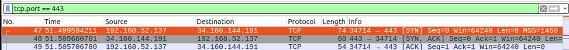

# Análisis Básico de Tráfico de Red con Wireshark

Este informe detalla la auditoría y análisis forense del tráfico generado durante una sesión controlada de red en un entorno Linux, dando cumplimiento estricto a los requisitos técnicos solicitados en la práctica obligatoria.

---

## Detalles de la Sesión
* **Documento entregable:** `wireshark-basic-analysis.md`
* **Herramienta utilizada:** Wireshark (Captura interactiva de paquetes)
* **Fichero generado:** `web_dns_capture.pcapng`
* **Entorno de pruebas:** Ubuntu Linux (Máquina Virtual)

---

## 1. ¿Qué se ha capturado? (Detalles de la sesión)
Se ha interceptado y registrado de extremo a extremo el ciclo de vida completo de una petición en internet. Para garantizar la limpieza de la captura y facilitar la localización de los vectores analizados, se ejecutaron de manera secuencial dos acciones diferenciadas:

* **Resolución de nombres en la terminal:** Se forzó una consulta DNS explícita ejecutando el comando `nslookup google.com` hacia el servidor DNS local de la infraestructura.
* **Conexión web e intercambio de datos:** Se generó tráfico HTTP/HTTPS mediante el navegador web Firefox al acceder activamente a la plataforma corporativa de `www.amazon.es`, levantando flujos de datos volumétricos en tiempo real.

---

## 2. Protocolos identificados en la captura
El análisis minucioso del archivo indexado `web_dns_capture.pcapng` revela la coexistencia de protocolos de red estructurados según el modelo TCP/IP en múltiples capas de abstracción:

* **Capa de Aplicación:** Presencia de protocolos **DNS** (Domain Name System) para la traducción interactiva de dominios, **HTTP** (Hypertext Transfer Protocol) y **TLS** (Transport Layer Security) derivado de la navegación segura bajo HTTPS.
* **Capa de Transporte:** Identificación plena del protocolo **UDP** (User Datagram Protocol) sirviendo de soporte de transmisión ágil para DNS a través del puerto 53, y el protocolo **TCP** (Transmission Control Protocol) actuando como canal seguro y confiable para el tráfico web (puertos 80 y 443).
* **Capa de Red:** Tráfico canalizado mediante direccionamiento **IPv4** nativo de la subred local (origen `192.168.52.137`) y direccionamiento avanzado **IPv6** (bloques de intercambio global de Amazon), el cual fue seleccionado automáticamente por el sistema operativo de la máquina virtual al contar con priorización de pila doble.

---

## 3. Fundamentos Teóricos Obligatorios

### ¿Qué es DNS?
El **Domain Name System (DNS)** es un sistema de asignación jerárquica encargado de actuar como el "listón telefónico" de internet. Su función primordial es traducir identidades alfanuméricas legibles por seres humanos (como `google.com`) en direcciones IP numéricas binarias (como `216.58.204.174`) que los routers y switches del planeta necesitan para enrutar los paquetes. Opera en la capa de aplicación y, por motivos de rendimiento y latencia mínima, hace uso prioritario de conexiones no orientadas a sesión bajo el protocolo **UDP en su puerto 53**.

### ¿Qué es TCP?
El **Transmission Control Protocol (TCP)** es el protocolo nuclear de la capa de transporte orientado a conexión y diseñado bajo premisas de máxima fiabilidad. A diferencia de UDP, TCP garantiza contractualmente que todos los segmentos de datos el destinatario sin corrupciones, en el orden secuencial exacto en el que fueron emitidos, y gestionando dinámicamente la congestión de la red. Si un paquete se pierde, TCP detiene el flujo y fuerza la retransmisión automática del segmento dañado antes de entregar los datos a la aplicación.

---

## 4. Análisis del Tráfico y Hallazgos Forenses

### A. Secuencia de la Consulta DNS
Tras aplicar el filtro de visualización `dns` en la interfaz de Wireshark, se aisló el flujo exacto de resolución:
* **Petición (Standard Query):** La máquina origen con la IP privada `192.168.52.137` generó una solicitud de registro tipo `A` (paquete número 2) y un registro tipo `AAAA` (paquete número 4) dirigida al servidor DNS local configurado en la dirección `192.168.52.2`.
* **Respuesta (Standard Query Response):** El servidor contestó de manera inmediata (paquetes 3 y 5) adjuntando el direccionamiento del dominio consultado, resolviendo de manera unívoca la IPv4 de Google como `216.58.204.174`.

> *Evidencia de la resolución e interacciones DNS:*
> 

### B. El Apretón de Manos de Tres Vías (TCP Three-Way Handshake)
Para abrir formalmente el canal de transporte web seguro hacia el servidor balanceador de Amazon (IP destino `34.160.144.191`) a través del puerto 443, se interceptó y auditó el proceso del *Three-Way Handshake* en estricto orden cronológico:

1. **Paquete 47 [SYN]:** La máquina virtual del alumno envía una solicitud de sincronización inicial al servidor remoto, estableciendo un número de secuencia aleatorio e indicando que desea abrir un canal de comunicación.
2. **Paquete 48 [SYN, ACK]:** El servidor de Amazon responde de forma bidireccional confirmando la recepción del paquete del cliente mediante un indicador de reconocimiento (`ACK`) y transmitiendo simultáneamente su propio flag de sincronización (`SYN`).
3. **Paquete 49 [ACK]:** La máquina local procesa la respuesta del servidor y envía el paquete de confirmación final. A partir de este microsegundo, el estado de la conexión TCP pasa a ser formalmente `ESTABLISHED` (Establecida), habilitando de manera segura el inicio de la transferencia de datos de la página web.

> *Evidencia del Handshake TCP 3-Way interceptado:*
> 

> ### Conclusiones del Aprendizaje
> A través de esta práctica de laboratorio, se asimila de forma pragmática que la conectividad en sistemas informáticos es un proceso secuencial estrictamente dependiente: ningún navegador web del planeta puede iniciar una negociación de transporte TCP sin haber completado previamente de manera exitosa un ciclo completo de intercambio de paquetes UDP bajo DNS para mapear la ubicación geográfica y lógica del servidor de destino.

---

## 5. Dudas Técnicas de Carácter Avanzado
Durante la auditoría del flujo web volumétrico de Amazon, se observó que inmediatamente después de consolidar el Handshake TCP de tres vías (paquetes 47, 48 y 49), la totalidad del tráfico subsiguiente pasa a encapsularse bajo el protocolo criptográfico TLS/HTTPS.

**La duda planteada es:** En un entorno corporativo o empresarial real (donde por motivos de privacidad y cumplimiento regulatorio no se cuenta de forma trivial con un archivo de claves de sesión compartidas `SSLKEYLOGFILE` para descifrar el tráfico localmente), ¿qué metodologías exactas o heurísticas avanzadas emplea un analista de ciberseguridad en un centro de operaciones de seguridad (SOC) o un ingeniero de Blue Team para cazar amenazas, exfiltración de información o balizamiento malicioso (*beaconing*) si los payloads de datos viajan 100% cifrados y opacos de extremo a extremo?
